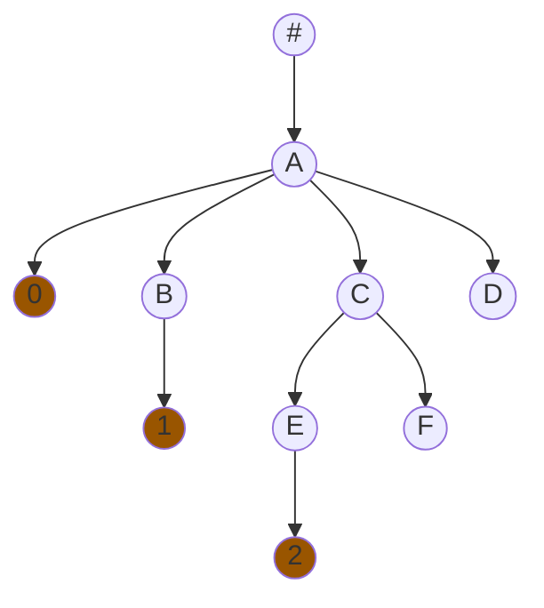
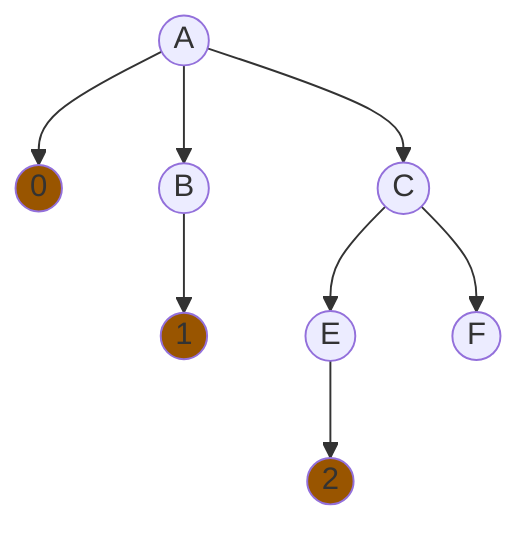
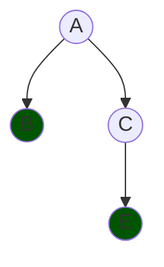
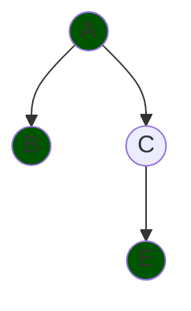
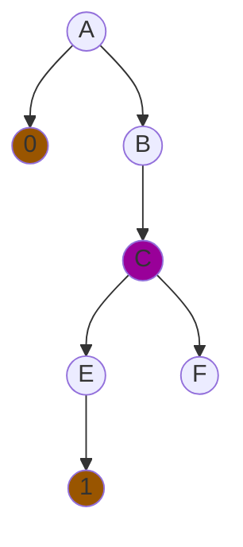
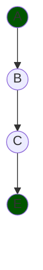

# methodical-js

## Wstęp

Framework pozwala na budowanie aplikacji internetowych w oparciu o składanie funkcji. Wybrane elementy HTML mają swoje odpowiedniki w postaci funkcji przyjmujących obiekt konfiguracyjny oraz funkcję będącą ciałem danego komponentu. Wewnątrz ciała możliwe jest wywołanie kolejnych funkcji odpowiadającym elementom, budując w ten sposób drzewiastą strukturę. Każdy obiekt konfiguracyjny musi posiadać identyfikator, który jest unikalny lokalnie, tzn. żaden inny komponent będący jego rówieśnikiem, nie może mieć tego samego identyfikatora (są one używane do śledzenia tego samego elementu pomiędzy różnymi wersjami drzewa). Na przykład, następujący kod:

```js
Div({ id: 'outer' }, () => {
  Div({ id: 'first', style: { padding: '8px' } }, () => {
    Text({ id: 'text', style: { fontWeight: 'bold' }, value: 'Pierwszy napis' })
  })

  Div({ id: 'second' }, () => {
    Text({ id: 'text', style: { fontStyle: 'italic' }, value: 'Drugi napis' })
  })
})
```

jest równoważny do kodu HTML:

```html
<div>
  <div style="padding: 8px">
    <span style="font-weight: bold">Pierwszy napis</span>
  </div>

  <div>
    <span style="font-style: italic">Drugi napis</span>
  </div>
</div>
```

Warto zwrócić uwagę na powtórzony identyfikator `text` dla elementów tekstowych - nie jest to problem, ponieważ znajdują się one w różnych poddrzewach, więc identyfikator jest unikalny lokalnie.

Kod HTML może wydawać się bardziej zwięzły, jednak to co otrzymujemy budując odpowiadającą mu hierarchię przy użyciu funkcji JavaScript, to dużo lepsze podpowiadanie składni, automatyczne sprawdzanie typów (dzięki integracji z TypeScript) oraz możliwość stosowania instrukcji sterujących (pętle, instrukcje warunkowe, instrukcje `switch`) bezpośrednio w kodzie odpowiadającym za interfejs. Powoduje to, że integracja z kodem odpowiedzialnym za logikę biznesową jest zdecydowanie prostsza.

Z racji tego, że tworzenie widoków odbywa się poprzez wywołanie odpowiednich funkcji, budowanie własnych komponentów to proste definiowanie funkcji. Wystarczy w ich ciele wywołać funkcje odpowiadające widokom. Możliwe jest tworzenie komponentów "granicznych" oraz "płaskich". Komponenty płaskie nie wpływają bezpośrednio na drzewo przechowujące obecny stan interfejsu, tzn. wywołanie takiej funkcji jest równoważne z wklejeniem jej ciała w miejsce wykonania (pewnego rodzaju mechanizm `inline`). Wszystkie funkcje wpływające na stan, będą odwoływać się do węzła, w którym dana funkcja została wywołana, np.:

```js
function Component() {
  const state = remember('123')

  Text({ id: 'text', value: state.value })
}

Div({ id: 'root' }, () => {
  Div({ id: 'header' }, () => {
    Text({ id: 'header-text', value: 'Header' })
  })

  Component()
})
```

jest równoważny do

```js
Div({ id: 'root' }, () => {
  Div({ id: 'header' }, () => {
    Text({ id: 'header-text', value: 'Header' })
  })

  const state = remember('123')

  Text({ id: 'text', value: state.value })
})
```

Modyfikacja stanu w tym przypadku spowoduje przebudowanie całego komponentu `root`. Komponenty płaskie są dobrym narzędziem w przypadku niedużych i statycznych części interfejsu, które powtarzają się w wielu miejscach interfejsu. Dla elementów posiadających stan, lepiej sprawdzą się komponenty graniczne. Tworzą one nowy węzeł w drzewie, stanowiący granicę dla aktualizacji stanu. W przypadku zmodyfikowania poprzedniego przykładu tak, aby tworzył granicę wyglądałby następująco:

```js
const Component = createBoundary(function (config) {
  const state = remember('123')

  Text({ id: 'text', value: state.value })
})

Div({ id: 'root' }, () => {
  Div({ id: 'header' }, () => {
    Text({ id: 'header-text', value: 'Header' })
  })

  Component({ id: 'boundary-component' })
})
```

W takim przypadku, modyfikacja stanu spowoduje przebudowanie tylko komponentu `Component`, jednak ze względu na tworzenie nowego węzła w wewnętrznej reprezentacji interfejsu wymagają one obiektu konfiguracyjnego zawierającego **przynajmniej** identyfikator.

Dodatkowo, wszystkie komponenty graniczne (w tym również wbudowane odpowiedniki elementów HTML) przyjmują w obiekcie konfiguracyjnym opcjonalny parametr `pure`. Komponenty oznaczone jako `pure` są przebudowywane tylko w przypadku kiedy zmienia się ich obiekt konfiguracyjny (ze względu na wartość, nie referencję). Jest to szczególnie przydatny parametr w przypadku optymalizacji przebudowywania drzewa, gdyż pozwala zatrzymać przebudowę na poziomie, na którym nie były wprowadzone żadne zmiany. Np.:

```js
Div({ id: 'root' }, () => {
  const state = remember('123')

  Div({ id: 'child1' }, () => {
    console.log(1)
  })
  Div({ id: 'child2' }, () => {
    console.log(2)
  })
  Div({ id: 'child3', pure: true }, () => {
    console.log(3)
  })
  Div({ id: 'child4' }, () => {
    console.log(4)
  })
})
```

Modyfikacja stanu w tym przypadku, spowoduje przebudowanie komponentu o id `root`, a tym samym również jego dzieci. Komponent `child3` jest oznaczony jako czysta funkcja oraz jego obiekt konfiguracyjny nie zmienia się, zatem poddrzewo tego węzła nie zostanie przebudowane. Tzn. Przy aktualizacji stanu na konsoli otrzymamy wynik `124`, ponieważ ciało `child3` nie zostanie wykonane.

## Dostępne funkcjonalności

### Widoki

Obecnie dostępne widoki:

- `SuspenseBoundary` - Pozwala na wyświetlanie tymczasowego stanu interfejsu kiedy wczytywane są rzeczywiste dane w połączeniu z funkcjami `suspend` i `defer`.
- `Div`
- `Input`
- `Text` (odpowiadający elementowi `<span />`)

Oczywiście, możliwe jest też tworzenie własnych funkcji odpowiadających wymaganym elementom HTML przy użyciu interfejsu `ViewNodeManager` oraz funkcji `createViewNode` oferowane przez klasę `WorkingTree`.

### Funkcje

- `remember<T>(value: T): RememberedValue<T>` - Tworzy węzeł przechowujący stan pomiędzy aktualizacjami interfejsu. Modyfikacja zapamiętanej wartości powoduje przebudowanie rodzica oraz aktualizację interfejsu.
- `sideEffect(() => (void | () => void), ...dependencies)` - Reprezentuje efekt uboczny funkcji. Pierwszym argumentem jest funkcja (która opcjonalnie może zwracać funkcję sprzątającą), kolejne argumenty to zależności, które są wariadyczne. Przy pierwszym wywołaniu efektu, wykonana zostanie funkcja z pierwszego argumentu i jej wynik wraz z zależnościami zostaje zapisany w drzewie stanu. W przypadku zmiany którejś z zależności (porównanie ze względu na referencję, nie wartość), wykonana zostanie funkcja sprzątająca (o ile została zwrócona) i efekt zostanie wykonany ponownie.
- `on(name: string, handler: (event) => void, ...dependencies)` - Reprezentuje obsługę zdarzenia o podanej nazwie. Za każdym razem kiedy zdarzenie o danej nazwie zostanie wyemitowane i jego celem będzie rodzic, w którym ta funkcja została wywołana, uruchomiona będzie funkcja przekazywana w drugim argumencie i obiekt reprezentujący zdarzenie zostanie jej przekazany. Węzeł w drzewie zostanie zaktualizowany w przypadku zmiany którejkowiek z zależności (ponownie, porównanie przez referencję).
- `suspend<T>(() => Promise<T>, ...dependencies): T` - Przyjmuje funkcję asynchroniczną jako pierwszy argument oraz listę zależności jako drugi. Przy pierwszym wywołaniu (oraz przy każdorazowej zmianie którejś z zależności - porównanie przez referencję) wywołuje otrzymaną funkcję oraz przerywa budowę obecnego poddrzewa aż do napotkania pierwszego komponentu typu `SuspenseBoundary` będącego jej przodkiem. Kiedy funkcja asynchroniczna się zakończy i zwróci wynik, poddrzewo zostaje przebudowane i zwrócona wartość jest możliwa do odczytu.
- `defer<T>(() => Promise<T>, ...dependencies): T` - Działa bardzo podobnie do `suspend` z tą różnicą, że w przypadku zmiany którejkolwiek z zależności budowa poddrzewa nie zostaje przerwana. Zamiast tego, wyświetlana jest poprzednia wersja drzewa a funkcja asynchroniczna jest uruchamiana w tle. Po jej zakończeniu, poddrzewo jest przebudowywane ze zaktualizowaną wartością.
- `memoize<T>(() => T, ...dependencies): T` - Pozwala na memoizację wyniku funkcji pomiędzy różnymi wersjami drzewa. Funkcja obliczająca wartość zostanie wywołana za pierwszym razem oraz w przypadku zmiany którejś z zależności. W pozostałych przypadkach, wykorzystana zostanie wartość obliczona wcześniej. Przydatna do optymalizacji złożonych obliczeń zależnych od stanu, który nie zawsze zmienia się podczas przebudowy drzewa.
- `createAmbient<T>(key: string): Ambient<T>` - Pozwala stworzyć komponent, który udostępnia swoim potomkom dodatkowe informacje które można odczytać na dowolnym poziomie w drzewie. Zwraca funkcję, która w swoim obiekcie konfiguracyjnym, przyjmuje pole `value: T` i zmiany tej wartości powodują przebudowanie wszystkich potomków, którzy ją odczytują. Szczególne znaczenie ma to w połączeniu z czystymi komponentami, które przerywają przebudowywanie poddrzewa. W takim przypadku, przebudowane zostaną tylko komponenty, które odczytują wartość.
- `readAmbient<T>(Ambient<T>): T` - Pozwala na odczytanie wartości udostępnianej przez przodka typu `Ambient`. Odczytanie wartości powoduje, że dany węzeł zaczyna nasłuchiwać na zmiany odczytanej wartości i jest przebudowaywany kiedy taka nastąpi.

### Nawigacja

Framework udostępnia dwa komponenty do budowania nawigacji: `Navigator` i `Route`. Oba komponenty przyjmują jako argumenty ścieżkę oraz funkcję budującą ich ciało. Ścieżka to wzór adresów, które powinny być dopasowane do danego komponentu. Ścieżka może być statyczna, ale może też być parametryzowana przez użycie symbolu `:`, np. `/user/:userId`. Wspomniane komponenty różnią się one zachowaniem: komponenty typu `Navigator` można zagnieżdzać, budując w ten sposób coraz bardziej złożoną nawigację, natomiast komponenty typu `Route` stanowią liście w kontekście nawigacji - nie mogą zawierać innych komponentów nawigacyjnych w swoich poddrzewach. Najprościej to zachowanie prezentuje prosty przykład:

```js
Navigator('/', () => {
  Route('/', () => Square('red'))

  Route('/random', () => {
    const red = Math.random() * 255
    const green = Math.random() * 255
    const blue = Math.random() * 255

    Square(`rgb(${red}, ${green}, ${blue})`)
  })

  Navigator('/custom', () => {
    Route('/:color', () => {
      const navigation = getNavigation()
      const color = navigation.params.color
      Square(color)
    })

    Route('/hex/:color', () => {
      const navigation = getNavigation()
      const color = navigation.params.color
      Square(`#${color}`)
    })
  })
})
```

Powyższy kod wyświetla kolorowy kwadra, którego kolor zależy od odwiedzonej ścieżki:

- `/` - kolor czerwony
- `/random` - losowy kolor
- `/custom/yellow` - kolor żółty
- `/custom/hex/000000` - kolor czarny

Dodarkowo dostępna jest funkcja `getNavigation()` zwracająca obiekt pozwalający na odczytywanie informacji o ścieżce oraz na jej modyfikowanie. Udostępnia następujące pola:

- `hash` - Zwraca część adresu po symbolu `#`
- `query` - Zwraca obiekt klucz-wartość na podstawie części adresu po symbolu `?`
- `params` - Zwraca obiekt klucz-wartość na podstawie parametrów występujących w ścieżce
- `back()` - Pozwala na powrót do poprzedniej ścieżki
- `navigate(string)` - Pozwala na nawigowanie do wskazanej ścieżki, jeżeli nowa ścieżka zaczyna się od `./` lub `../` jest ona traktowana jako relatywna do obecnej, w przeciwnym wypadku jest traktowana jako ścieżka absolutna. Możliwe jest też przekazanie napisu zaczynającego się od `#` lub `?` żeby zmodyfikować odpowiednio pole `hash` i `query`.

Każda zmiana ścieżki powoduje aktualizację komponentów odpowiedzialnych za nawigację, które następnie próbują dopasować ścieżkę do wzorca który miały przekazane jako argument. Jeżeli dopasowanie się uda, wywoływane jest ich ciało.

## Opis wysokopoziomowy

Wewnętrznie, hierarchia komponentów przechowywana jest w strukturze drzewa. Korzeń jest zawsze zdefiniowany i pełni rolę wartownika aby drzewo nigdy nie było puste. Podczas inicjalizacji, element w którym budowana będzie hierarchia elementów HTML jest przypisywany jako referencja widoku w korzeniu i nie zmienia się w trakcie działania aplikacji. Każda z funkcji odpowiedzialnych za tworzenie elementów, manipulację stanem lub wywoływanie efektów, wewnętrznie wykonuje operacje na drzewie.

### Opis drzewa

Drzewo może zawierać kilka rodzajów węzłów, które można podzielić na dwie grupy: widoki i efekty. Widoki są węzłami używanymi do budowania hierarchi interfejsu, natomiast efekty pozwalają na jego interaktywność. W związku z tym można wyróżnić ważną cechę: węzły odpowiadające efektom zawsze będą liściami, natomiast węzły wewnętrzne zawsze będą widokiem.

Budowanie interfejsu opiera się na składaniu kolejnych funkcji - widok otrzymuje obiekt konfiguracyjny oraz funkcję reprezentującą jego ciało. Wewnętrznie wywoływana jest odpowiednia metoda na drzewie (`WorkingTree.createViewNode`), która przed wykonaniem funkcji ciała, ustawia odpowiednią referencję do właśnie utworzonego węzła. W ten sposób, kiedy węzeł jest tworzony ma on dostęp do swojego rodzica, a tym samym do wszystkich swoich przodków. Dodatkowo, w przypadku aktualizacji, propagowana jest referencja do odpowiadającego węzła w poprzednim drzewie co pozwala na propagację stanu pomiędzy różnymi wersjami drzewa oraz na optymalizowanie przypadków kiedy dany węzeł nie musi zostać przebudowany.

Każdy węzeł przechowuje znaczące informacje, które różnią się w zależności od typu:

- `ViewNode` - Przechowuje obiekt konfiguracyjny oraz funkcję reprezentującą ciało, które są wykorzystywane w przypadku przebudowy.
- `RootNode` - Wyróżniony `ViewNode` pełniący rolę wartownika.
- `RebuildingNode` - Wyróżniony `ViewNode`, tworzony podczas procesu przebudowy drzewa.
- `SuspenseBoundary` - Specjalny rodzaj `ViewNode`, zawierający logikę obsługującą przerywanie budowania poddrzewa oraz przechowywanie tymczasowego staniu węzłów przerywających.
- `Ambient` - Specjalny rodzaj `ViewNode`, który udostępnia pewną wartość wszystkim swoim potomkom oraz pozwala obserwować jej zmiany. W przypadku zmiany wartości, kolejkowana jest aktualizacja na wszystkich obserwujących węzłach.
- `RememberNode` - Przechowuje obiekt proxy opakowujący zapamiętaną wartość. Modyfikacja wartości tego obiektu powoduje zakolejkowanie aktualizacji rodzica.
- `EffectNode` - Przechowuje funkcję sprzątającą oraz zależności. W przypadku zmiany zależności, wywoływana jest funkcja sprzątająca oraz nowo zbudowany efekt.
- `SuspendNode` - Przechowuje funkcję asynchroniczną, zwróconą wartość oraz zależności. W przypadku zmiany zależności, funkcja uruchamiana jest na nowo a budowa danego poddrzewa jest przerywana. Kiedy uruchomiona funkcja się zakończy, kolejkowana jest aktualizacja na pierwszym przodku typu `SuspenseBoundary`.
- `DeferNode` - Specjalny rodzaj `SuspendNode`, który przerywa budowanie poddrzewa tylko przy pierwszym utworzeniu. Podczas aktualizacji, w przypadku zmiany zależności, uruchamiana jest funkcja asynchroniczna, a kiedy się zakończy kolejkowana jest aktualizacja na pierwszym przodku typu `SuspenseBoundary`.

Warto zwrócić uwagę na fakt, że nie każdy węzeł widoku musi posiadać referencję do faktycznego widoku (elementu HMTL), w szczególności takowej nie posiadają węzły `Ambient`, `SuspenseBoundary` oraz `RebuildingNode`.

### Pierwsza budowa drzewa

Do rozpoczęcia działania, wymagane jest zawołanie metody `init` oraz przekazania jej referencji do elementu, w którym ma być zbudowana hierarchia komponentów, np.:

```js
Methodical.init(document.getElementById('app'))
```

Przypisuje ona otrzymaną referencję elementu do korzenia drzewa, buduje pierwsze drzewo i uruchamia pętlę, która w każdej klatce sprawdza czy zakolejkowane były aktualizacje stanu i ewentualnie aplikuje je powodując przebudowanie drzewa tak aby odzwierciedlało nowy stan. W większości przypadków (chyba że zastosowane będą "płaskie" komponenty), każdej funkcji widoku i efektu będzie odpowiadał dokładnie jeden węzeł w drzewie, np.:

```js
Div({ id: 'A' }, () => {
  const val = remember(0)

  Div({ id: 'B' }, () => {
    const val = remember(1)
  })

  Div({ id: 'C' }, () => {
    Div({ id: 'E' }, () => {
      const val = remember(2)
    })

    Div({ id: 'F' }, () => {})
  })

  Div({ id: 'D' }, () => {})
})
```

spowoduje zbudowanie następującego drzewa (kolorem pomarańczowym oznaczone są węzły efektów):



Węzeł `#` reprezentuje korzeń wykorzystywany wewnętrznie przez framework i będzi pomijany w kolejnych diagramach.

### Modyfikacja stanu

Do przechowywania stanu wykorzystywana jest funkcja `remember`, tworząca w drzewie węzeł `RememberNode`. Każdy węzeł tego typu przechowuje obiekt proxy pozwalający na dostęp do zapamiętanej wartości (i jest on zwracany przez `remember`). Przechwytuje on operacje zapisu i przy każdej z nich kolejkuje aktualizację na swojego rodzica, ponieważ zmiana zapamiętanej wartości może mieć wpływ na jego rodzeństwo (warość może być użyta jako zależność, lub do manipulacji samym drzewem przy użyciu instrukcji sterujących).

Kolejkowanie aktualizacji obsługiwane jest za pomocą drzewa prefiksowego, w którym zapisywana jest ścieżka do aktualizowanego węzła. Podczas aplikowania aktualizacji, obliczane są prefiksy ścieżek i węzły znajdujące się na tych ścieżkach są przebudowywane. Pozwala to uniknąć niepotrzebnego przebudowywania węzłów w sytuacjach gdzie aktualizowany jest zarówno rodzic jak i któryś z jego potomków. Przy naiwnej implementacji przebudowane zostałyby oba węzły, przy czym potomek (a tym samym całe poddrzewo) byłby przebudowany dwukrotnie - pierwszy raz przez przebudowanie rodzica, drugi przez bezpośrednie przebudowanie potomka. Można tą sytuację łatwo zilustować rozważając następujące drzewo, w którym węzły pomarańczowe przechowują stan:



W przypadku modyfikacji wartości zapisanej w węzłach `1` i `2`, zakolejkowane zostaną następujące aktualizacje:



Gdyby aktualizacja została zaaplikowana w takim stanie, przebudowane zostałyby węzły `B` oraz `E`. Jeżeli jednak zostanie też zmodyfikowana wartość zapisana w węźle `1`, zakolejkowana zostanie kolejna aktualizacja:



W takiej sytuacji bezpośrednio przebudowany zostanie tylko węzeł `A`, ponieważ jego ścieżka stanowi prefiks dla dwóch pozostałych aktualizacji. Istnieje jednak przypadek, w którym powinny zostać przebudowane zarówno komponent znajdujący się na ścieżce reprezentowanej przez prefiks, jak i komponenty leżące głębiej w drzewie. Kiedy na ścieżce pomiędzy dwoma komponentami oczekującymi na aktualizację znajduje się czysty komponent, którego konfiguracja się nie zmieniła opisane powyżej podejście spowodowałoby zgubienie aktualizacji dla komponentu leżącego głębiej, np.:



Przyjmując, że węzeł `C` reprezentuje czysty komponent i jego konfiguracja nie zmieniła się aplikując następującą aktualizację, która jest możliwa do uzyskania np. przez obsługę zdarzenia, lub zmianę wartości na obserwowanym węźle `Ambient`:



Na węźle `C` przebudowywanie poddrzewa zostałoby przerwane i węzeł `E` nie zostałby przebudowany. Dlatego w przypadku wykorzystywania poprzedniego poddrzewa przez czysty komponent, dodatkowo sprawdza on czy nie ma zakolejkowanej aktualizacji na którys z jego potomków poprzez sprawdzenie drzewa prefiksowego. Jeżeli odpowiadający mu węzeł istnieje, oznacza to że któryś z jego potomków lub on sam powinny zostać zaktualizowane, w takiej sytuacji aktualizacja na odpowiednie węzły jest rekolejkowana i wykonywana w tym samym cyklu aby uniknąć rozbieżności w stanie pomiędzy węzłami.
